# Flavoneer Brand & Design Guide

As of 2026-10-08. Asset paths are relative to this folder. Regenerate everything with
`node design/scripts/build.mjs` (see [README.md](README.md)).

## Brand foundation

Flavoneer is the workspace where food products are formulated, tested, and checked on the production line. The brand has to feel like lab equipment people trust, with enough warmth that scientists and line inspectors want to open it every day.

| Element | Statement |
| --- | --- |
| Promise | From benchtop trial to factory release, in one connected record. |
| Tagline | The intelligent workspace for food formulations. |
| Short tagline | Formulate with precision. |
| Category | Food R&D and quality software (web lab, mobile QC app, 3D QC floor view) |
| Audience | Food scientists and R&D leads; QA/QC managers; production-line inspectors |
| Markets | English and Arabic (right-to-left), FDA and EU regulatory frameworks |

**Personality.** Precise, warm, practical, and a little playful.

- **Precise.** Numbers, units, and versions are always exact. The design never trades legibility for decoration.
- **Warm.** Mint, amber, and a soft serif make a technical tool feel like a kitchen, not a control room.
- **Practical.** Every screen helps someone make a decision or record a fact. No ornamental dashboards.
- **Playful, in one place.** The orange one-eyed mascot carries the humor so the product UI does not have to.

**What Flavoneer is not.** It is not a recipe or consumer cooking app. It is not a generic SaaS look with purple gradients. It is not cartoonish inside data-heavy screens.

## Logo

The F symbol is the primary logo. The mascot wordmark is the signature, used where the brand can be playful. All files are generated from the Fraunces ExtraBold glyphs and live in `exports/logo/`.

| F symbol | Wordmark | Mascot wordmark |
| --- | --- | --- |
| 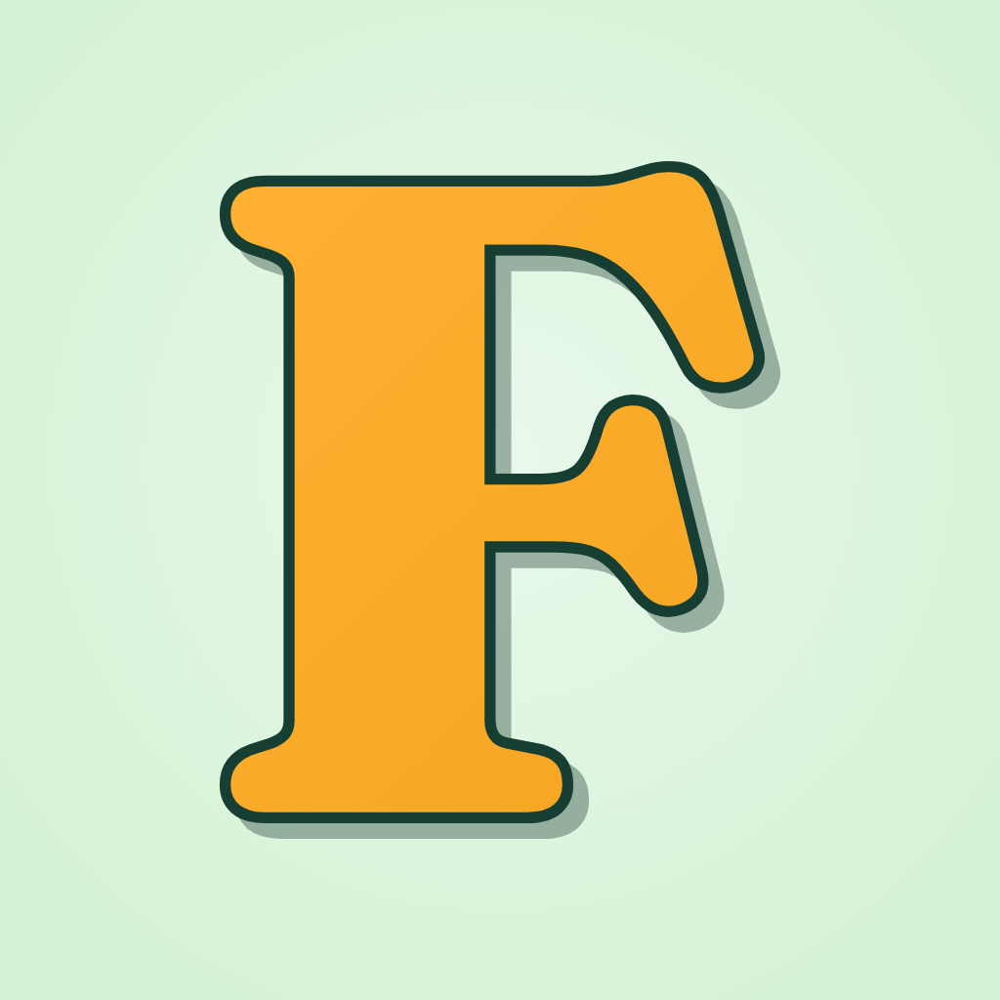 | 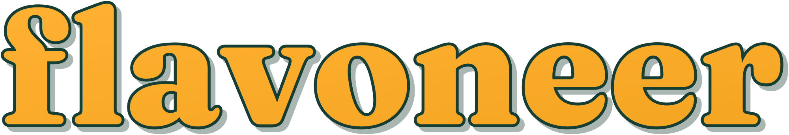 | 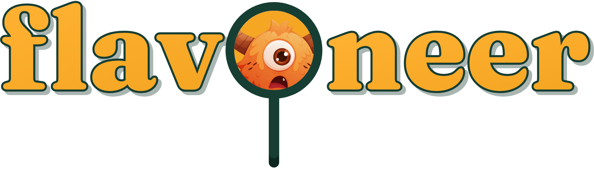 |

| Asset | What it is | Use it for | File |
| --- | --- | --- | --- |
| F symbol | Amber Fraunces F with an ink outline and a 35% deep-forest offset shadow | App icons, favicons, avatars, small spaces | `svg/flavoneer-mark.svg` |
| F tile | The F on the mint radial tile | App Store, Play, PWA icons | `svg/flavoneer-mark-tile.svg` |
| Wordmark | Lowercase "flavoneer" in the same amber, outline, and shadow style | Marketing headers, merch, decks | `svg/flavoneer-wordmark.svg` |
| Solid wordmark | One color: forest, amber, cream, black, white | Documents, UI headers, print, embossing | `svg/flavoneer-wordmark-<color>.svg` |
| Lockup | F tile + forest wordmark, side by side | Website nav, email signatures, partner pages | `svg/flavoneer-lockup.svg`, `-on-dark.svg` |
| Mascot wordmark | "flav" + the mascot pan as the o + "neer", from the landing header | Landing hero, social, launch moments | `svg/flavoneer-mascot-wordmark.svg`, `-on-dark.svg` |
| Mascot pan | The one-eyed orange mascot as a frying pan, on mint | Social avatar option, stickers, empty states | `png/flavoneer-mascot-pan-1024.png` |

**Name.** Always write "Flavoneer" in running text. The logo itself is lowercase: "flavoneer". Never write FlavoNeer or FLAVONEER.

**Clear space.** Leave at least the width of the F stem on every side (about 12% of the symbol width; for the wordmark, the height of the "n").

**Minimum sizes.**

| Asset | Screen | Print |
| --- | --- | --- |
| F symbol | 16 px (favicon file is tuned for this) | 6 mm |
| Wordmark, signature style | 120 px wide | 30 mm |
| Wordmark, solid | 80 px wide | 20 mm |
| Mascot wordmark | 200 px wide (the face stops reading below this) | 50 mm |

**Which version on which background.**

- Mint, cream, or white: signature or forest versions.
- Forest or deep forest: amber or cream solids, or the `-on-dark` lockup and mascot wordmark.
- Amber or orange: forest solid only.
- Photos: cream or forest solid, whichever passes 4.5:1 on the area behind it.

**Do not:** recolor the F outside the palette, remove the outline from the signature style, stretch or rotate it, add a glow or gradient background, set the wordmark in another typeface, use the mascot wordmark under 200 px, or put the signature wordmark on amber (it disappears).

## Color

Flavoneer is mint and forest green with amber as the one loud color. A rough balance is 60% mint or cream, 30% forest, 10% amber and orange. The values below match `rd/mobile/src/constants/theme.ts` and the landing CSS, and are also stored in [`tokens.json`](tokens.json).

**Brand palette**

| Token | Hex | Role |
| --- | --- | --- |
| mint | #D2F2D4 | Signature background: landing hero, app icon, splash |
| mintSoft | #E9F8EA | Light canvas, icon tile highlight |
| cream | #FFFDF4 | Cards and raised surfaces in light mode |
| forest | #1C4A3C | Primary buttons, nav, brand blocks |
| deepForest | #102F27 | Dark sections, logo shadow |
| ink | #173E33 | Body text and logo outline |
| copy | #527568 | Secondary text on light backgrounds |
| amber | #F5A623 | Logo fill, primary CTA, highlights |
| amberLight | #FFC760 | Hover and pressed states for amber |
| orange | #FF7738 | Hand-drawn loop, focus rings, text selection, one accent per screen |
| darkCanvas | #0D2B24 | Dark-mode background |
| darkCopy | #A9CBBB | Secondary text in dark mode |

**Status colors** (new, proposed for QC records; also in `tokens.json`)

| Status | Background | Text | Contrast |
| --- | --- | --- | --- |
| Approved | #D2F2D4 | #1C4A3C | 8.3:1 |
| Pending review | #FFE3A8 | #6B3F05 | 7.2:1 |
| Returned | #FFD9C5 | #7A2E0B | 7.2:1 |
| Draft | #F3E7C8 | #4F3A12 | 8.8:1 |

**Light and dark mode.** Light mode is ink text on mintSoft with cream cards, and forest is the primary action. Dark mode is #F7F4DF text on darkCanvas with #173E33 cards, and amber becomes the primary action with ink text on it.

**Contrast rules (WCAG AA)**

| Pair | Ratio | Allowed for |
| --- | --- | --- |
| ink on mint / mintSoft / cream | 9.8 / 10.8 / 11.6 | All text |
| copy on mintSoft / cream | 4.7 / 5.0 | Body text, captions |
| cream on forest | 9.8 | All text, button labels |
| ink on amber | 5.8 | Button labels, stat cards |
| amber on deepForest | 7.1 | Eyebrows, headings, logo |
| darkCopy on darkCanvas | 8.6 | Secondary text in dark mode |
| amber on mint | 1.7 | Never for text. Only the outlined logo, which carries its own ink edge |
| orange on cream, or white on orange | 2.6 | Never for text. Decoration and focus rings only. On orange, use #2E1A10 (6.3) |

## Typography

Fraunces sets headlines and DM Sans sets everything else. Both are free Google Fonts, and both already ship in the landing page and the mobile app.

| Role | Typeface | Weights | Notes |
| --- | --- | --- | --- |
| Display and headings | Fraunces | 800 (default), 900 for app titles, 700 for long headings | Tight tracking: -0.02em on web, -0.8 to -1.25 pt on mobile titles |
| Text and UI | DM Sans | 400 body, 500 default UI, 600 labels, 700 buttons, 800 overlines | Never below 12 px |
| Numbers in data | DM Sans with tabular figures | 600 to 700 | Use `font-variant-numeric: tabular-nums` in tables |
| Codes and serials | System monospace | 400 to 700 | Batch codes (060826 1), form serials (H2-0412) |
| Arabic | System Arabic: SF Arabic on iOS, Noto Sans Arabic on Android | 400 and 700 | Fraunces and DM Sans have no Arabic glyphs. Letter spacing is always 0 |

**Type scale** (from `themed-text.tsx` and the landing page)

| Style | Mobile | Web | Font |
| --- | --- | --- | --- |
| Hero | n/a | 60 to 64 px / 1.03 | Fraunces 800 |
| Title | 38 / 43 | 48 to 60 px / 1.05 | Fraunces 900 |
| Display | 34 / 39 | 36 to 48 px | Fraunces 800 |
| Section | 22 / 28 | 24 to 30 px | Fraunces 800 |
| Body | 16 / 24 | 16 to 18 px / 1.6 | DM Sans 500 |
| Small | 14 / 20 | 14 px | DM Sans 500 |
| Overline | 11 / 16, uppercase, +2 pt tracking | 12 to 14 px, +0.15em | DM Sans 800 |
| Caption | 12 / 18 | 12 px | DM Sans 500 |

**Rules.** Use sentence case for headlines and buttons. Use uppercase only for overlines and eyebrows. Use one Fraunces line or block per view, plus section heads. Fraunces is never for body copy, table cells, or anything under 18 px.

## Design language

Flavoneer looks like a clean lab bench in a warm kitchen. It uses soft round shapes, flat color blocks, and one hand-drawn gesture. Data screens stay quiet, and marketing surfaces get the motifs.

**Brand motifs**

| Motif | What it looks like | Where it goes | Limit |
| --- | --- | --- | --- |
| Orange loop | Two hand-drawn orange ellipses (4 px and 2 px) circling a key phrase | Headlines on landing, social, and store screenshots | One per composition, around 1 to 3 words |
| Forest wave and blob | Organic forest shapes with 48% radius, rotated 6 degrees | Behind the mascot, section transitions | Marketing only |
| Bubbles | Outline circles, 22% forest border, 16% white fill, drifting slowly | Mint backgrounds | 4 to 7 per canvas, none over text |
| Lab grid | 32 px grid lines at 6% mint on deep forest | Dark sections, feature posts | Dark backgrounds only |
| Mascot | The one-eyed orange monster peeking over a bottom edge, paws visible | Heroes, covers, empty states, onboarding | Never inside data tables or forms. Never cropped above the paws |

**Shape and space**

- Buttons, pills, and nav are fully rounded (999 px).
- Cards use an 8 px radius on web and 16 to 20 px on mobile. Sheets use 24 to 28 px.
- App icon corners follow the platform mask. Exported tiles use 22.37% when a radius has to be drawn.
- Spacing steps are 2, 4, 8, 16, 24, 32, 64. Mobile screens use 20 px side padding and an 800 px max content width.
- Borders are 1 px forest at 14% opacity. Use borders and color blocks for depth. Use shadows only for floating items (menus, phone mockups).

**Buttons**

- Primary on light: forest fill, cream label. Primary CTA on marketing: amber fill, ink label, with a 3 to 4 px inset bottom shadow (rgba(182, 97, 8, 0.22)).
- Secondary: 2 px forest outline, forest label. On hover it fills forest with a white label.
- Hover scales to 1.05. Focus shows a 2 px orange outline with a 2 px offset.

**Iconography.** Lucide icons, 1.8 stroke, rounded caps, at 16 to 27 px. In the app, use SF Symbols on iOS and Material Symbols on Android where the platform expects them. Icons take the text color, and amber marks only the active state.

**Imagery.** Use real food-lab and factory photos: benches, pilot lines, cartons, hands at work. Grade them warm with green shadows. No stock photos of people pointing at screens, no 3D blobs, no AI images of food. Product UI shown in marketing must use realistic data (Cultured Oat Drink V4, 100.0 kg, $184.20).

**Motion.** Entrances fade up over 480 ms with a spring. Hover and press take 300 ms. Bubbles drift on 12 to 16 s loops. The mascot blinks. Everything respects reduced-motion settings.

**Right-to-left.** Every layout mirrors for Arabic, including the mascot side, the loop, and chevrons. Codes, serials, times, and numbers stay left-to-right inside RTL text.

## Voice and tone

Flavoneer writes like a senior food scientist explaining something to a colleague: exact, calm, and short. The playfulness belongs to the mascot, not the copy.

| Principle | Do | Don't |
| --- | --- | --- |
| Lead with the outcome | Mass balance that never drifts. | Our revolutionary AI-powered platform... |
| Use real units and names | 100.0 kg batch, $0.37 per serving, FDA and EU labels | Massive savings, best-in-class compliance |
| Speak the lab's language | Formulation, trial, version, release, hourly inspection | Recipes, content, items, tasks |
| Keep UI text short and literal | Confirm batch code · Retake photo · Pending review | Let's lock this in! · Oops, try again? |
| Say what to do next in errors | Allow camera access to capture the printed carton label. | Something went wrong. |

**Tone by channel.**

- Product UI: neutral and instructive. Short sentences, no exclamation marks.
- Landing and store pages: confident and concrete. One benefit per line.
- Social: warmer. The mascot can speak in captions, but facts stay exact.
- Regulatory and QC copy: formal and precise. Never imply certification the product does not hold.

**Arabic.** Write it natively, not as a word-for-word translation. Use Modern Standard Arabic for UI and keep technical terms consistent with `ar.json` (for example, مراقبة الجودة for quality control, and الفحوصات الساعية for hourly inspections).

**Boilerplate (50 words).** Flavoneer is the intelligent workspace for food formulations. R&D teams build and validate recipes with live mass balance, costs, nutrition, and FDA and EU allergen labeling. Quality teams then record hourly line inspections, carton batch codes, and approvals on mobile, so every product stays traceable from benchtop trial to factory release.

## App Store and Google Play

The icon is the F tile on both stores. There are five screenshots per store, in the same order, built from the app's real strings and theme. All files are in `exports/app-store/`.

| Store | Asset | Size | File | Spec notes |
| --- | --- | --- | --- | --- |
| App Store | App icon | 1024 × 1024 | `ios/app-icon-1024.png` | RGB, no alpha (verified), square corners; Apple applies the mask |
| App Store | iPhone 6.9" screenshots × 5 | 1320 × 2868 | `ios/screenshots-6.9in/` | Apple scales these down for smaller iPhones. No iPad set is needed, since tablet support is off |
| Google Play | App icon | 512 × 512 | `google-play/icon-512.png` | Full bleed, no alpha; Play applies the round mask |
| Google Play | Feature graphic | 1024 × 500 | `google-play/feature-graphic-1024x500.png` | Text kept out of the bottom-right area that a promo video button can cover |
| Google Play | Phone screenshots × 5 | 1080 × 1920 | `google-play/phone-screenshots/` | 9:16, meets the 1080 px minimum for promotion |
| Both | Adaptive and iOS 26 icon layers | 432 and 1024 | `rd/mobile/assets/` (unchanged) | Already wired in `app.config.ts`: mint #D2F2D4 background, monochrome layer |

| 1 | 2 | 3 | 4 | 5 |
| --- | --- | --- | --- | --- |
| 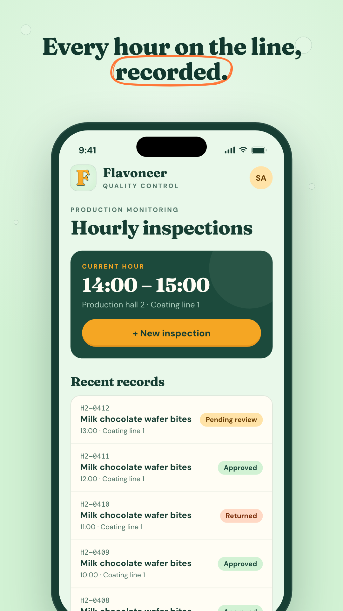 | 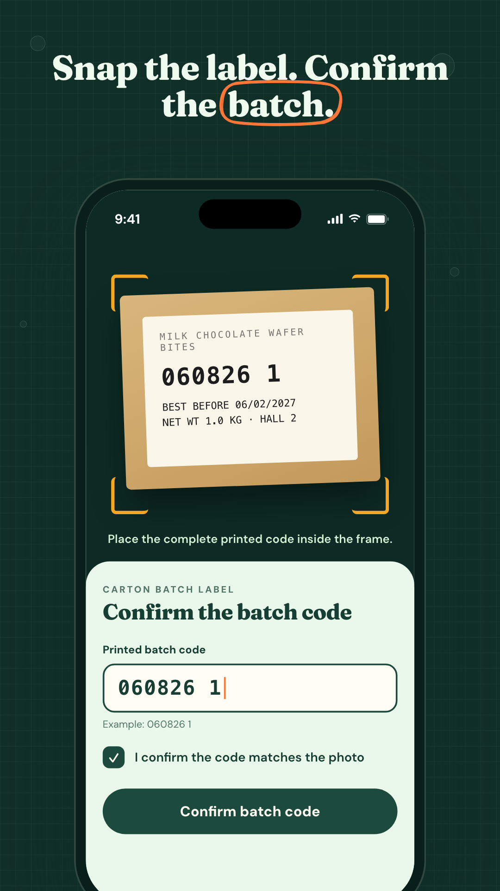 | 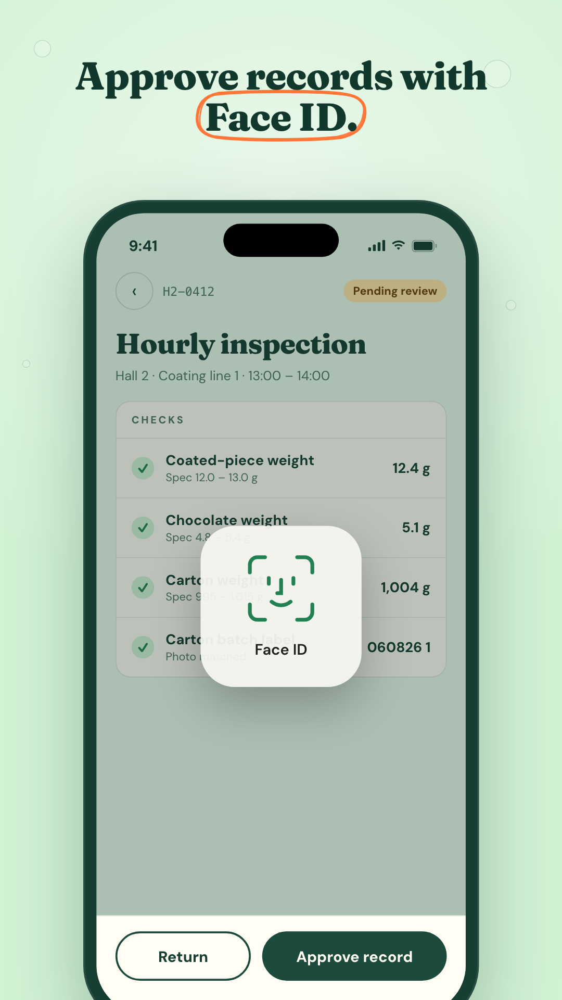 | 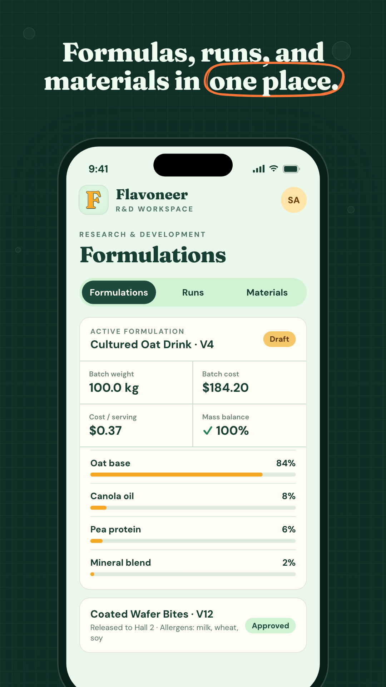 | 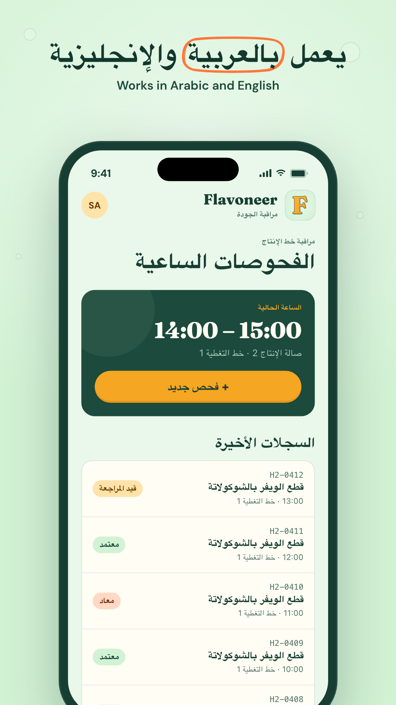 |

**Screenshot story**

1. *Every hour on the line, recorded.* Hourly inspections list with status chips (light).
2. *Snap the label. Confirm the batch.* Carton label capture and batch code entry (dark).
3. *Approve records with Face ID.* Inspection checks with the Face ID prompt (light).
4. *Formulas, runs, and materials in one place.* R&D formulation card (dark).
5. *يعمل بالعربية والإنجليزية / Works in Arabic and English.* The inspections screen in RTL (light).

The phone screens are high-fidelity mockups drawn from `en.json` and `ar.json`, not captures from a device. Before submitting, swap them for captures from a physical iPhone and Android phone, or confirm the mockups match the shipping build. Apple rejects screenshots that misrepresent the app.

**Listing copy**

| Field | Limit | Copy |
| --- | --- | --- |
| App name | 30 | Flavoneer |
| iOS subtitle | 30 | Food R&D and line QC |
| Play short description | 80 | Formulate, inspect, and approve food products from the lab to the line. |
| Keywords (iOS) | 100 | food,formulation,quality control,QC,HACCP,inspection,batch,R&D,recipe,allergen,production |
| Promotional text | 170 | Hourly line inspections, carton batch-code capture, and Face ID approvals, connected to your R&D formulations. |

## Social media

Every platform gets the same F avatar and a mint cover with the wordmark, tagline, and peeking mascot. Text sits inside each platform's safe area, so profile photos and mobile crops never cover it. Files are in `exports/social/`.

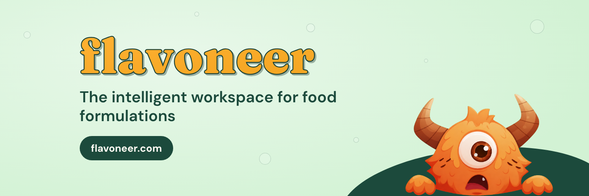

**Per-platform kit**

| Platform | Profile image | Cover or banner | Posts |
| --- | --- | --- | --- |
| LinkedIn (company) | `profile/avatar-mark-400.png` | `covers/linkedin-company-cover-1128x191.png` (text starts 180 px in, clear of the logo) | `posts/post-feature-1080x1080.png`, `post-stat-1080x1080.png`, link previews use `open-graph-1200x630.png` |
| LinkedIn (founder profiles) | Personal photo | `covers/linkedin-banner-1584x396.png` (text starts 380 px in, clear of the photo) | Same as company |
| X | `profile/avatar-mark-400.png` | `covers/x-header-1500x500.png` | `post-feature`, `post-stat`, `open-graph` |
| Instagram | `profile/avatar-mark-400.png` (shown at 320, circle crop) | n/a | `post-hero-1080x1350.png` (4:5 feed), square posts, `story-1080x1920.png` |
| Facebook | `profile/avatar-mark-400.png` | `covers/facebook-cover-1640x624.png` (content inside the center 1110 px for the mobile crop) | Square posts, `open-graph` for links, story |
| YouTube | `profile/avatar-mark-800.png` | `covers/youtube-banner-2560x1440.png` (content inside the 1546 × 423 safe area) | Thumbnails: reuse the post-feature layout at 1280 × 720 |
| TikTok | `profile/avatar-mascot-400.png` | n/a | `story-1080x1920.png` as a cover frame |
| Threads | Linked to Instagram | n/a | Same as Instagram |

**Avatar choice.** The F avatar is the default because it matches the app icon. The mascot pan avatar (`avatar-mascot-*.png`) is for playful channels such as TikTok, or for a launch week.

**Post templates**

| Hero | Feature | Stat | Story |
| --- | --- | --- | --- |
| 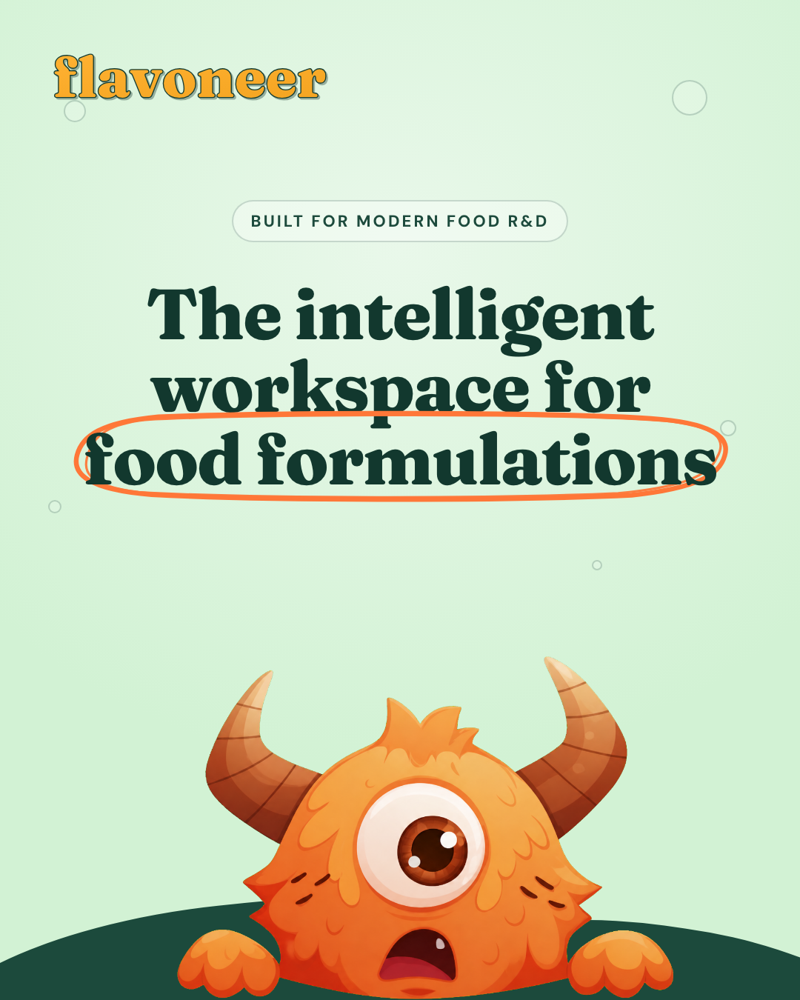 | 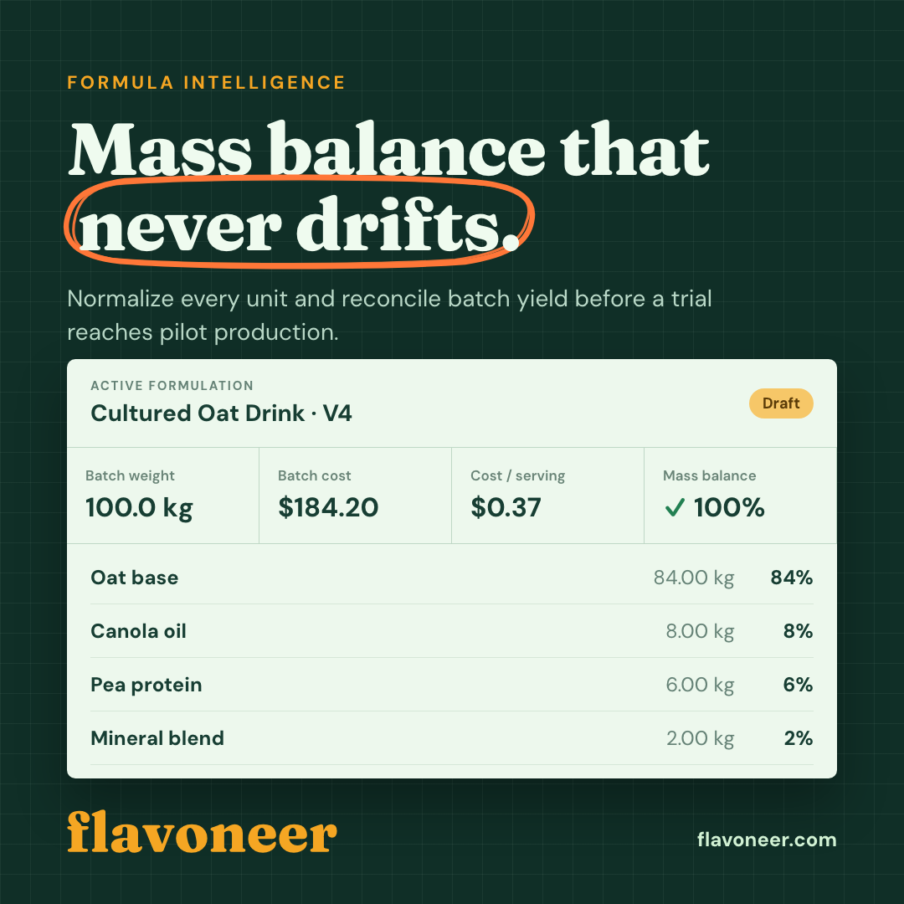 | 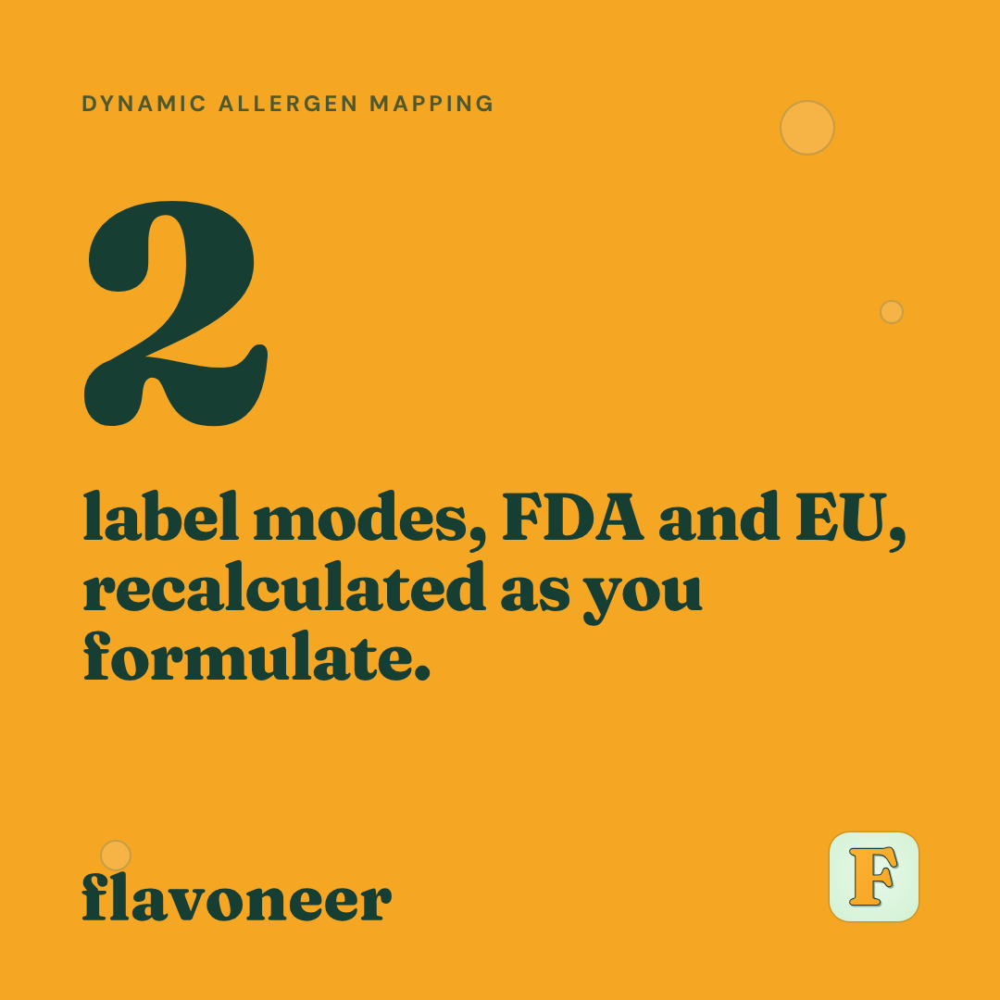 | 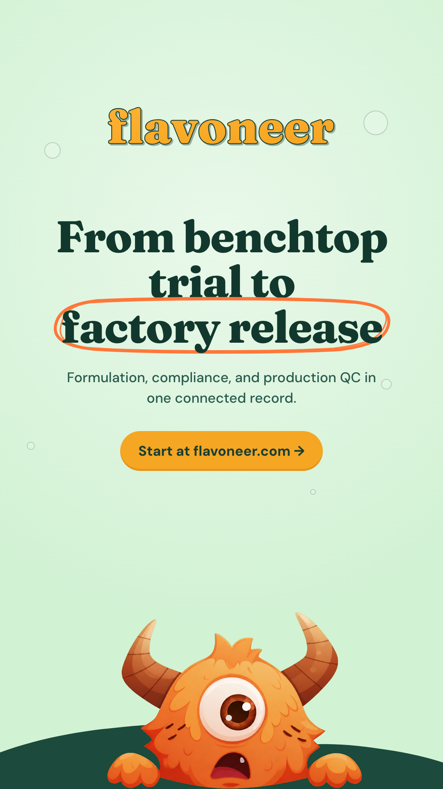 |

| Template | Size | Use it for |
| --- | --- | --- |
| Hero | 1080 × 1350 | Launches, brand intros. Mint background, loop headline, mascot |
| Feature | 1080 × 1080 | One capability with real product UI. Deep forest background with the lab grid |
| Stat | 1080 × 1080 | One number with a one-line claim. Amber background, ink text |
| Story or Reel cover | 1080 × 1920 | Stories, Reels, Shorts, TikTok. Keep text between 250 px and 1580 px from the top |
| Link preview | 1200 × 630 | Open Graph and Twitter cards for flavoneer.com |

**Posting rules.** One idea per post. The loop goes around at most 3 words. Captions follow the voice rules above. Use at most 3 hashtags, from #FoodScience, #FoodTech, #QualityControl, #RnD, and #FoodSafety.

## Asset inventory

All files live under `design/`. One script generates them from the brand fonts and tokens: `node design/scripts/build.mjs` (add a word such as `social` to rebuild only matching paths).

| Folder | Files | Contents |
| --- | --- | --- |
| `exports/logo/svg/` | 17 | F symbol (signature, tile, 5 solids), wordmark (signature, 5 solids), lockup × 2, mascot wordmark × 2 |
| `exports/logo/png/` | 14 | 512 to 2000 px renders of the main logo versions, plus the mascot pan |
| `exports/app-store/ios/` | 6 | App icon, five 6.9" screenshots |
| `exports/app-store/google-play/` | 7 | Icon, feature graphic, five phone screenshots |
| `exports/social/profile/` | 4 | F and mascot avatars at 400 and 800 px |
| `exports/social/covers/` | 5 | X, LinkedIn company, LinkedIn banner, Facebook, YouTube |
| `exports/social/posts/` | 5 | Hero, feature, stat, story, Open Graph |
| `exports/web/` | 11 | favicon.ico (16/32/48), favicon.svg, PNG favicons, Apple touch icon, PWA 192/512 and maskable, OG image |
| `tokens.json` | 1 | Machine-readable palette, status colors, type, radii, spacing |

**Open items**

- [ ] Decide whether the F symbol or the mascot pan leads as the primary logo (this guide assumes the F).
- [ ] Replace the screenshot mockups with captures from physical devices before store submission, or confirm they match the build.
- [ ] Have a native speaker review the Arabic product name in screenshot 5 (قطع الويفر بالشوكولاتة).
- [ ] Pick one light canvas value. The landing uses #E9F8EA and the mobile app uses #EEF8EB.
- [ ] Adopt the status colors in the mobile and web QC screens.
- [ ] Point the landing `favicon.ico` and Open Graph tags at `design/exports/web/`.
